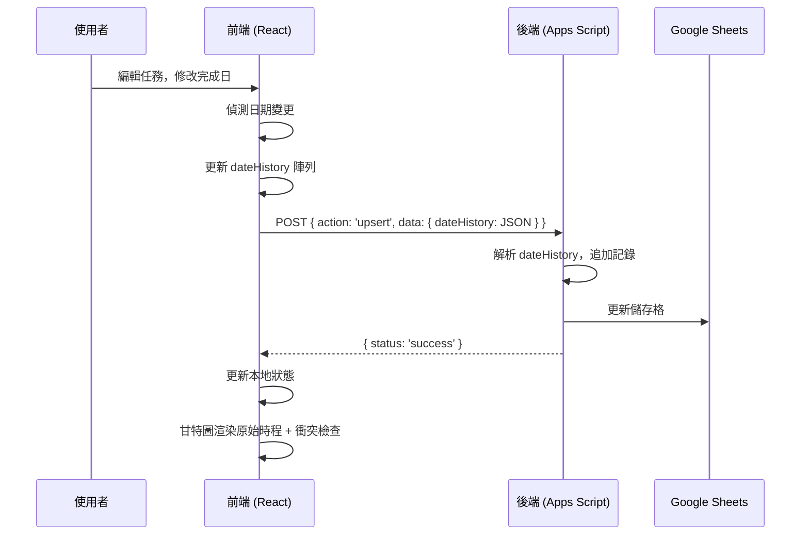

# 日期變更追蹤與相依性衝突警告功能 - 技術實作文件

## 功能概述

本文件描述如何在專案管理系統中實作以下功能：

1. **日期變更歷史追蹤** - 記錄任務完成日的每次變更，包含時間戳與變更原因
2. **甘特圖視覺化** - 顯示原始規劃時程（淺色）與目前時程的對照
3. **相依性衝突警告** - 當前置任務完成日晚於後續任務開始日時警告

---

## 資料結構設計

### 核心欄位：`dateHistory`

採用 **JSON 字串** 儲存於資料庫（如 Google Sheets）的單一欄位中。

```json
[
  {
    "date": "2025-12-10",
    "changedAt": "2025-12-01T08:00:00.000Z",
    "reason": "初始規劃",
    "version": 1
  },
  {
    "date": "2025-12-15",
    "changedAt": "2025-12-10T14:30:00.000Z",
    "reason": "等待零件到貨",
    "version": 2
  },
  {
    "date": "2025-12-20",
    "changedAt": "2025-12-14T09:15:00.000Z",
    "reason": "人力調度",
    "version": 3
  }
]
```

### 欄位說明

| 欄位 | 類型 | 說明 |
|------|------|------|
| `date` | string (YYYY-MM-DD) | 該版本的完成日 |
| `changedAt` | string (ISO 8601) | 變更時間戳 |
| `reason` | string | 變更原因 |
| `version` | number | 版本序號 (1-based) |

### 設計決策

- **為何用 JSON 字串？** Google Sheets 不支援原生陣列欄位，JSON 字串可完整保存結構化資料
- **為何記錄完整歷史？** 相較於只記錄「原始日期」，完整歷史可追蹤多次延期的原因與時間

---

## 後端實作 (Google Apps Script)

### 1. 資料讀取 (doGet)

讀取時直接回傳 `dateHistory` 字串，由前端解析。

```javascript
// 在 doGet 中，dateHistory 會作為字串回傳
var result = rows.map(function(row) {
  var obj = {};
  headers.forEach(function(header, i) {
    obj[header] = row[i]; // dateHistory 會是 JSON 字串
  });
  return obj;
});
```

### 2. 資料寫入 (doPost - upsert)

寫入時自動偵測日期變更，若有變更則追加記錄。

```javascript
// 核心邏輯
if (action === 'upsert') {
  var item = params.data;
  var existingDateHistory = '[]';
  var dateHistoryIndex = headers.indexOf('dateHistory');

  // 取得現有記錄
  if (rowIndex > 0 && dateHistoryIndex !== -1) {
    existingDateHistory = data[rowIndex - 1][dateHistoryIndex] || '[]';
  }

  // 解析歷史記錄
  var history = [];
  try {
    history = JSON.parse(existingDateHistory);
  } catch (e) {
    history = [];
  }

  // 檢查日期是否變更
  var lastRecord = history.length > 0 ? history[history.length - 1] : null;
  var currentDate = item.date;

  if (!lastRecord || lastRecord.date !== currentDate) {
    // 日期有變更，新增記錄
    history.push({
      date: currentDate,
      changedAt: new Date().toISOString(),
      reason: item.dateChangeReason || (history.length === 0 ? '初始規劃' : '日期調整'),
      version: history.length + 1
    });
  }

  // 將歷史存回 item
  item.dateHistory = JSON.stringify(history);
}
```

### 3. 批量初始化工具

為現有任務建立初始記錄的輔助函式：

```javascript
function initializeDateHistory() {
  var sheet = SpreadsheetApp.getActiveSpreadsheet().getActiveSheet();
  var data = sheet.getDataRange().getValues();
  // ... 遍歷所有任務
  // 若 dateHistory 為空，以當前 date 建立初始記錄
  // 若只有 1 筆且日期不同，在開頭補建原始記錄
}
```

---

## 前端實作 (React)

### 1. 資料載入與初始化

從 API 載入資料時，解析 `dateHistory` JSON 字串：

```javascript
const formatted = data.map(item => {
  const normalizedDate = normalizeDate(item.date);
  
  // 解析 dateHistory
  let dateHistory = [];
  try {
    dateHistory = item.dateHistory ? JSON.parse(item.dateHistory) : [];
  } catch (e) {
    dateHistory = [];
  }
  
  // 若無歷史記錄，以當前 date 建立初始記錄
  if (dateHistory.length === 0 && normalizedDate) {
    dateHistory = [{
      date: normalizedDate,
      changedAt: new Date().toISOString(),
      reason: '初始規劃',
      version: 1
    }];
  }
  
  return {
    ...item,
    date: normalizedDate,
    dateHistory: dateHistory // 已解析的陣列
  };
});
```

### 2. 表單儲存邏輯

偵測日期變更並更新 `dateHistory`：

```javascript
const handleSave = (e) => {
  e.preventDefault();
  const fd = new FormData(e.target);
  const newDate = fd.get('date');
  const dateChangeReason = fd.get('dateChangeReason')?.trim() || '';
  
  // 取得現有 dateHistory
  let dateHistory = editingTask?.dateHistory || [];
  
  // 偵測日期是否變更
  const oldDate = editingTask?.date;
  const isDateChanged = editingTask && oldDate !== newDate;
  const isNewTask = !editingTask;
  
  // 更新 dateHistory
  if (isNewTask || isDateChanged) {
    dateHistory = [...dateHistory, {
      date: newDate,
      changedAt: new Date().toISOString(),
      reason: isNewTask ? '初始規劃' : (dateChangeReason || '日期調整'),
      version: dateHistory.length + 1
    }];
  }
  
  // 傳送給後端時轉為 JSON 字串
  const apiData = {
    ...newItem,
    dateHistory: JSON.stringify(dateHistory)
  };
};
```

### 3. 表單 UI

新增「日期變更原因」輸入欄位與歷史記錄顯示：

```jsx
{/* 日期變更原因 - 僅編輯模式顯示 */}
{editingTask && (
  <div className="bg-amber-50 border border-amber-200 rounded-lg p-3">
    <label>📅 日期變更原因 (若有調整完成日)</label>
    <input name="dateChangeReason" placeholder="例如：等待零件、人力調度..." />
  </div>
)}

{/* 日期變更歷史 */}
{editingTask?.dateHistory?.length > 0 && (
  <div className="bg-slate-50 rounded-lg p-3">
    <label>📋 日期變更歷史</label>
    {editingTask.dateHistory.map((h, idx) => (
      <div key={idx}>
        <span>v{h.version}</span>
        <span>{h.date}</span>
        <span>{h.reason}</span>
      </div>
    ))}
  </div>
)}
```

---

## 甘特圖視覺化

### 判斷條件

```javascript
const history = Array.isArray(t.dateHistory) ? t.dateHistory : [];
const originalDate = history.length > 0 ? history[0].date : null;
const hasDateChange = history.length > 1 && originalDate !== t.date;
```

### 原始時程區塊 (淺色半透明)

```jsx
{hasDateChange && (
  <div
    className="gantt-bar"
    style={{
      left: `${origLeft}px`,
      width: `${origWidth}px`,
      backgroundColor: 'rgba(148, 163, 184, 0.4)',
      border: '2px dashed #64748b',
      zIndex: 10  // 低於目前時程的 z-index: 20
    }}
    title={`原始規劃: ${originalDate}`}
  />
)}
```

### 延期天數標籤

```jsx
{hasDateChange && (
  <span className="bg-red-100 text-red-600 text-[9px] px-1 rounded">
    +{delayDays}天
  </span>
)}
```

### 延期天數計算

```javascript
const origEndDate = new Date(originalDate);
const currEndDate = new Date(t.date);
const delayDays = Math.round((currEndDate - origEndDate) / (1000 * 60 * 60 * 24));
```

---

## 相依性衝突偵測

### 判斷邏輯

當前置任務的完成日 ≥ 後續任務的開始日時，判定為衝突。

```javascript
const hasDependencyConflict = (task) => {
  if (!task.dependency) return { hasConflict: false, conflicts: [] };
  
  const depIds = parseDependencies(task.dependency);
  const taskStart = getStartDate(task.date, task.duration);
  const conflicts = [];
  
  for (const depId of depIds) {
    const parent = sortedTasks.find(p => String(p.id) === String(depId));
    if (!parent) continue;
    
    const parentEnd = parent.date; // 前置任務完成日
    
    // 衝突條件：前置完成日 >= 此任務開始日
    if (parentEnd >= taskStart) {
      conflicts.push({
        parentId: parent.id,
        parentTask: parent.task,
        parentEnd: parentEnd,
        taskStart: taskStart,
        overlapDays: Math.ceil((new Date(parentEnd) - new Date(taskStart)) / (1000 * 60 * 60 * 24)) + 1
      });
    }
  }
  
  return { hasConflict: conflicts.length > 0, conflicts };
};
```

### 視覺呈現

| 元素 | 正常 | 衝突時 |
|------|------|--------|
| 任務條框線 | 無 | 3px solid #dc2626 (紅色) + 發光陰影 |
| 任務列背景 | 白色 | bg-red-50 (淡紅色) |
| 任務名稱旁 | - | 橘色「⚠️ 衝突」標籤 |
| 相依性連線 | #94a3b8 (灰色) | #dc2626 (紅色) + 加粗 |

### SVG 箭頭定義

```jsx
<defs>
  <marker id="arrowhead" markerWidth="6" markerHeight="4" refX="5" refY="2" orient="auto">
    <polygon points="0 0, 6 2, 0 4" fill="#94a3b8" />
  </marker>
  <marker id="arrowhead-red" markerWidth="6" markerHeight="4" refX="5" refY="2" orient="auto">
    <polygon points="0 0, 6 2, 0 4" fill="#dc2626" />
  </marker>
</defs>
```

---

## 完整流程圖



---

## 關鍵設計要點

1. **前後端雙軌處理**：前端維護陣列，後端維護 JSON 字串，傳輸時轉換
2. **版本號管理**：使用 `version` 欄位追蹤變更次數
3. **初始化策略**：現有資料需批量補建初始記錄才能正確顯示
4. **z-index 分層**：原始時程 (10) < today-line (15) < 目前時程 (20)
5. **衝突偵測時機**：在渲染時即時計算，無需額外 API 呼叫

---

## 版本資訊

- **v7.0**: 日期變更歷史追蹤功能
- **v7.1**: 相依性衝突警告功能
